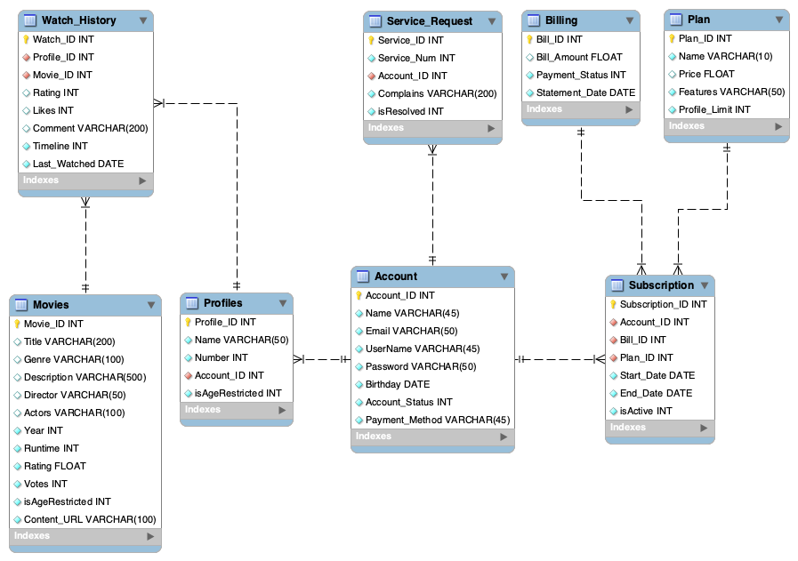

# SJSU Movie Database System

The SJSU Movie Database (SMD) project aims to design and implement a database to store and manage information about movies, users, profiles, subscriptions, and billing. The goal is to build a system similar to Netflix where users can search, rate and review movies and manage their accounts.

## Two database implementations were developed and compared:

### 1. Relational Database Design
A relational database was designed using MySQL to store movies, users, profiles, and related data in separate tables.

 

ER Diagram of the relational schema

The ER diagram shows the entities - Movies, Genre, Cast, Customers, Accounts, Profiles, Subscriptions, Billing, etc. and the relationships between them.

Key functions like search, filters, CRUD operations, and analytics were implemented using SQL queries, triggers, and stored procedures in MySQL. Transactions, indexing and constraints ensure data integrity.

2. Document Database Design
MongoDB was used to store the data in a flexible document model instead of separate tables.

Document Model

Document structure for storing related movie and user data

Related data is embedded within documents instead of normalized across multiple tables. This denormalized data model improves performance for reads and throughput.

The same key functions were implemented using MongoDB queries and aggregations. Indexing and embedding optimize for faster access compared to joins.

Comparison and Conclusion
MySQL relational model has better data integrity, and isolation and suits applications with transactional data.
MongoDB document model is more flexible, scalable and provides higher performance for reads and writes.
For this movie management use case, MongoDB provided faster performance for queries, inserts, and updates compared to MySQL.
However, MySQL was better for simple searches due to full-text indexing and native query optimization.
Overall, MongoDB's dynamic schema and scalability make it more suitable for rapidly evolving data and changing application requirements.
In summary, both SQL and NoSQL databases have their pros and cons. The optimal choice depends on the specific application, data, and performance needs. This project provided valuable experience in modeling, implementing and optimizing databases using both relational and non-relational approaches.
